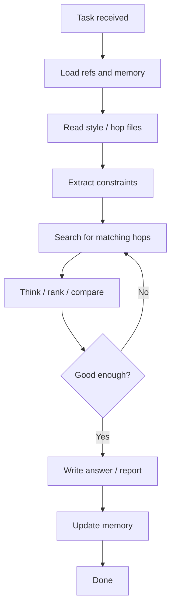

# Hermes Loop Diagram

```mermaid
flowchart TD
    A["Task received"] --> B["Load refs and memory"]
    B --> C["Read style / hop files"]
    C --> D["Extract constraints"]
    D --> E["Search for matching hops"]
    E --> F["Think / rank / compare"]
    F --> G{"Good enough?"}
    G -- No --> E
    G -- Yes --> H["Write answer / report"]
    H --> I["Update memory"]
    I --> J["Done"]
```

Use this as the basic Hermes loop for simple search-and-answer tasks.
