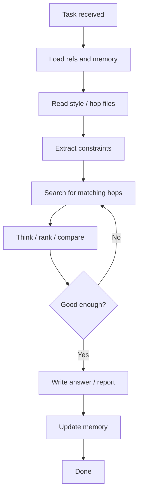

# Hermes Loop Diagram

Use this as the basic Hermes loop for simple search-and-answer tasks.

<!--
Instructor mode: learning the Hermes loop

Purpose
-------
The Hermes loop is a repeatable way to turn a user request into a grounded,
useful answer. Each stage has a specific job: gather context, apply constraints,
search trusted project data, evaluate the candidates, answer, and remember the
result. The loop is intentionally small so it stays understandable and works
well on the project's older Intel Mac target.

How to read the diagram
-----------------------
1. Task received: Start with the user's actual request. For this project, an
   example is: "Suggest hops for an IPA."
2. Load refs and memory: Read mutable context from `memory/` and stable domain
   facts from `refs/`. Memory tells Hermes what the project is doing; refs tell
   it what the known beer styles and hop traits are.
3. Read style / hop files: Select the relevant JSON records, such as a beer
   style profile and the hop catalog. Keeping these facts in files makes the
   demo inspectable and avoids hiding knowledge inside a large prompt.
4. Extract constraints: Identify requirements such as beer style, desired
   flavor, number of hops, exclusions, or the need for a simple recipe direction.
   Constraints prevent a technically plausible answer from missing the user's
   intent.
5. Search for matching hops: Compare the request with the reference data. The
   local runner performs this as a small, deterministic lookup and ranking task.
6. Think / rank / compare: Explain why candidates fit, compare tradeoffs, and
   check that the shortlist is not just a collection of matching keywords.
7. Good enough?: This is a quality gate, not a request for perfection. If the
   evidence is thin or a constraint is unmet, return to search and improve the
   candidate set. If the answer is supported and complete enough, continue.
8. Write answer / report: Present the shortlist, rationale, and practical
   direction in language the user can act on. Separate known reference facts
   from recommendations or assumptions.
9. Update memory: Record durable results, decisions, or task progress in
   `memory/`. Do not put stable beer-style facts in memory; those belong in
   `refs/`, which is protected by the project rules.
10. Done: Finish only after the answer has been written and any useful state
    has been recorded.

How this maps to the repository
-------------------------------
- `src/index.ts` is the intended entry point for shared source code.
- `refs/beer_styles.json` and `refs/hop_catalog.json` provide stable lookup data.
- `memory/project-state.json` provides the current project focus and constraints.
- `memory/tasks.json` tracks active and completed work.
- `memory/decisions.json` records why the project uses this workflow.
- `scripts/validate-memory.mjs` provides a lightweight validation check.

Implementation lesson
---------------------
The arrows describe data flow, not magic intelligence. At every arrow, ask:
"What input is produced here, and what does the next stage need?" For example,
the search stage should receive extracted constraints, and the answer stage
should receive ranked candidates plus their evidence. This makes the workflow
easy to test one stage at a time and easy to replace later.

Final tips
----------
- Read `memory/` before making a recommendation and update it after meaningful
  work.
- Treat `refs/` as stable source material; do not edit it as a shortcut for
  recording session results.
- Keep the quality gate explicit: verify fit, constraints, and evidence before
  answering.
- Prefer small, dependency-free scripts while the project is docs-first.
- When extending the loop, add one clear stage with a clear input and output,
  then validate it through `scripts/`.
-->
